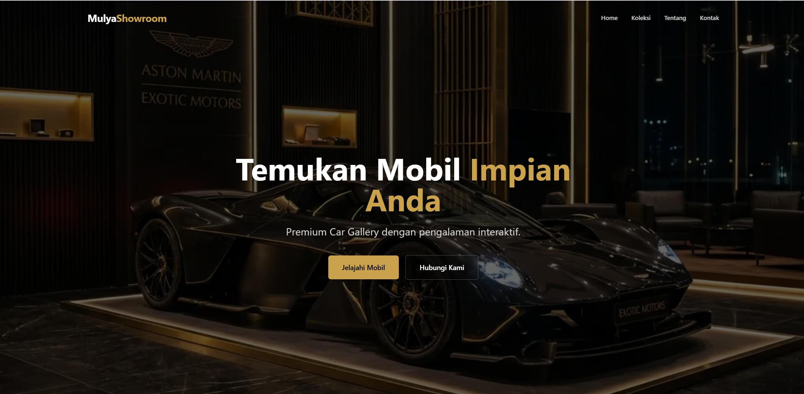
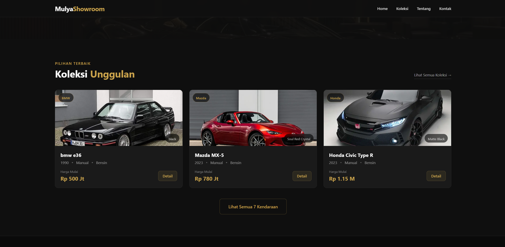

# 🚀 MulyaShowroom - Premium Car Dealership


MulyaShowroom adalah aplikasi web interaktif untuk showroom mobil premium yang dirancang untuk memudahkan pengguna dalam melihat koleksi kendaraan, mengetahui detail spesifikasi, dan melakukan simulasi kredit. Dibangun dengan antarmuka yang elegan dan mewah, aplikasi ini memastikan pengalaman pengguna yang modern dan responsif. Di sisi backend, aplikasi ditenagai oleh **Next.js App Router**, **Prisma ORM**, dan **MySQL** untuk manajemen data yang aman dan handal.

---

## 📸 Cuplikan Layar (Screenshots)
*(Di bawah ini adalah gambaran halaman utama aplikasi)*

| Home | Koleksi |
| :---: | :---: |
|  |  |


## ✨ Fitur Utama

### 🧑‍💻 Fitur Pengguna (User)
* **Koleksi Kendaraan:** Lihat daftar mobil premium dengan detail spesifikasi lengkap seperti mesin, tenaga, fitur interior, dan eksterior.
* **Simulasi Kredit & Booking:** Hitung perkiraan cicilan bulanan secara instan dan form pemesanan (booking) kendaraan secara langsung.
* **Tampilan Premium & Animasi Halus:** Antarmuka dengan skema warna gelap keemasan, efek animasi framer-motion saat di-scroll, dan responsif di berbagai perangkat.

### 🛡️ Fitur Administrator
* **Manajemen Kendaraan Dinamis (CRUD):** Tambahkan, edit, dan hapus data mobil beserta harga dan spesifikasi teknis lengkapnya.
* **Upload Gambar Otomatis:** Fitur upload gambar kendaaran terintegrasi menggunakan konversi Base64.
* **Sinkronisasi Data Real-time:** Setiap perubahan di panel admin akan langsung diperbarui di halaman koleksi publik.

---

## 🛠️ Teknologi yang Digunakan

* **Framework:** Next.js 13+ (App Router), React 18
* **Bahasa Pemrograman:** TypeScript
* **Database & ORM:** MySQL (via Laragon) & Prisma ORM
* **Styling & UI:** Tailwind CSS, Framer Motion, Lucide React (Icons)
* **API:** Next.js API Routes (JSON payloads)

---

## 💻 Cara Instalasi & Menjalankan (Local Development)

Aplikasi MulyaShowroom sangat mudah dijalankan menggunakan **Laragon** atau server lokal lainnya.

### 1. Persiapan Database
1. Pastikan **Laragon** sudah terinstal dan berjalan (Start All).
2. Buka fitur database (HeidiSQL / phpMyAdmin).
3. Buat database baru dengan nama `showroom`.

### 2. Setup Environment
Buka terminal di dalam folder proyek ini dan jalankan perintah berikut:

1. **Install Dependensi:**
   ```bash
   npm install
   ```
2. **Konfigurasi Environment:**
   Pastikan file `.env` sudah ada dan berisi URL koneksi database yang benar:
   ```env
   DATABASE_URL="mysql://root:@localhost:3306/showroom"
   ```
3. **Migrasi Database:**
   Singkronkan skema Prisma dengan database:
   ```bash
   npx prisma db push
   ```

### 3. Menjalankan Aplikasi
Setelah instalasi selesai, jalankan server pengembangan dengan perintah:
```bash
npm run dev
```
Aplikasi akan aktif. Buka browser Anda dan kunjungi: 
```text
http://localhost:3000
```

> **Catatan Akses Admin:** 
> Untuk saat ini, dashboard admin dapat langsung diakses melalui URL `/admin`. 
# CarShowroom
